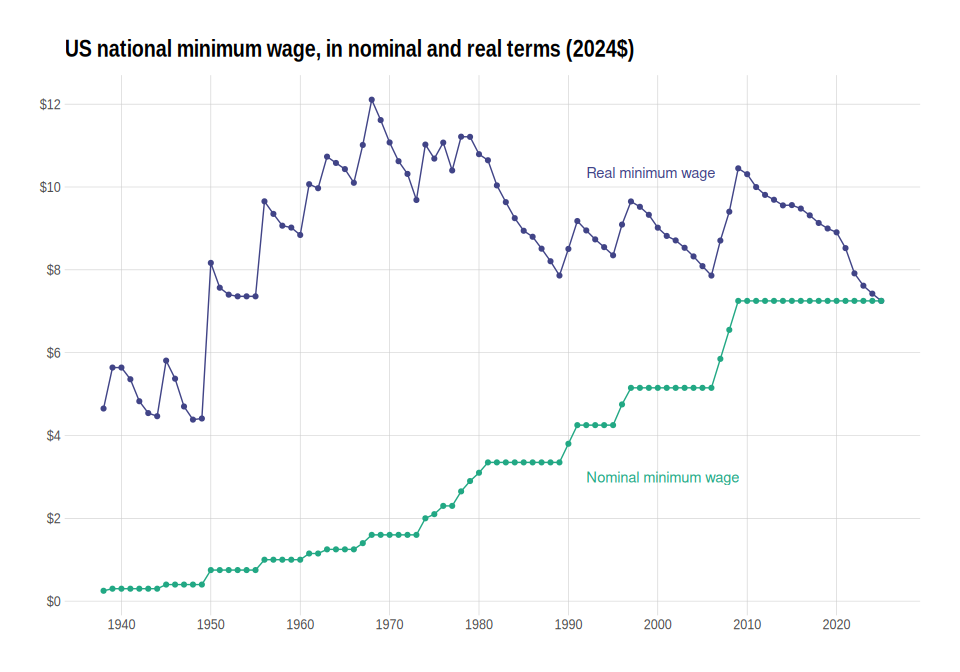

<!-- README.md is generated from README.Rmd. Please edit that file -->

# realtalk <a href="https://economic.github.io/realtalk/"></a>

<!-- badges: start -->
<!-- badges: end -->

realtalk makes it easy to use common US price indexes in R.



## Loading the data

`realtalk` is mostly a data package and includes several datasets of
common US price indexes, like the CPI-U-RS:

``` r
library(realtalk)
cpi_u_rs_annual
#> # A tibble: 45 × 2
#>     year cpi_u_rs
#>    <dbl>    <dbl>
#>  1  1978     104.
#>  2  1979     114.
#>  3  1980     127.
#>  4  1981     139.
#>  5  1982     148.
#>  6  1983     154.
#>  7  1984     160.
#>  8  1985     166.
#>  9  1986     168.
#> 10  1987     174.
#> # ℹ 35 more rows
```

You can see what datasets are available by loading
`available_price_indexes`:

``` r
available_price_indexes
#> # A tibble: 17 × 6
#>    index_name         frequency seasonal min_date max_date package_data_name    
#>    <chr>              <chr>     <chr>    <chr>    <chr>    <chr>                
#>  1 C-CPI-U            annual    <NA>     2000     2022     c_cpi_u_annual       
#>  2 C-CPI-U            monthly   NSA      Dec 1999 Oct 2023 c_cpi_u_monthly_nsa  
#>  3 C-CPI-U, extended  annual    <NA>     1937     2022     c_cpi_u_extended_ann…
#>  4 C-CPI-U, extended  monthly   NSA      Jan 1937 Oct 2023 c_cpi_u_extended_mon…
#>  5 C-CPI-U, extended  monthly   SA       Jan 1947 Oct 2023 c_cpi_u_extended_mon…
#>  6 CPI-U              annual    <NA>     1937     2022     cpi_u_annual         
#>  7 CPI-U              monthly   NSA      Jan 1937 Oct 2023 cpi_u_monthly_nsa    
#>  8 CPI-U              monthly   SA       Jan 1947 Oct 2023 cpi_u_monthly_sa     
#>  9 CPI-U-RS           annual    <NA>     1978     2022     cpi_u_rs_annual      
#> 10 CPI-U-RS           monthly   NSA      Dec 1977 Dec 2022 cpi_u_rs_monthly_nsa 
#> 11 CPI-U-RS, extended annual    <NA>     1937     2022     cpi_u_rs_extended_an…
#> 12 CPI-U-RS, extended monthly   NSA      Jan 1937 Oct 2023 cpi_u_rs_extended_mo…
#> 13 CPI-U-RS, extended monthly   SA       Jan 1947 Oct 2023 cpi_u_rs_extended_mo…
#> 14 CPI-U-X1           annual    <NA>     1967     1982     cpi_u_x1_annual      
#> 15 CPI-U-X1           monthly   NSA      Jan 1967 Dec 1982 cpi_u_x1_monthly_nsa 
#> 16 PCE                annual    <NA>     1929     2022     pce_annual           
#> 17 PCE                monthly   SA       Jan 1959 Sep 2023 pce_monthly_sa
```

The `package_data_name` column contains the internal name of each
dataset:

``` r
pce_monthly_sa
#> # A tibble: 777 × 3
#>     year month   pce
#>    <dbl> <dbl> <dbl>
#>  1  1959     1  15.2
#>  2  1959     2  15.2
#>  3  1959     3  15.2
#>  4  1959     4  15.2
#>  5  1959     5  15.2
#>  6  1959     6  15.3
#>  7  1959     7  15.3
#>  8  1959     8  15.3
#>  9  1959     9  15.4
#> 10  1959    10  15.4
#> # ℹ 767 more rows
```

You can also use `get_price_index()`:

``` r
get_price_index("PCE", "monthly", "SA")
#> # A tibble: 777 × 3
#>     year month   pce
#>    <dbl> <dbl> <dbl>
#>  1  1959     1  15.2
#>  2  1959     2  15.2
#>  3  1959     3  15.2
#>  4  1959     4  15.2
#>  5  1959     5  15.2
#>  6  1959     6  15.3
#>  7  1959     7  15.3
#>  8  1959     8  15.3
#>  9  1959     9  15.4
#> 10  1959    10  15.4
#> # ℹ 767 more rows
```

## Installation

``` r
# install.packages("devtools")
devtools::install_github("Economic/realtalk")
```
